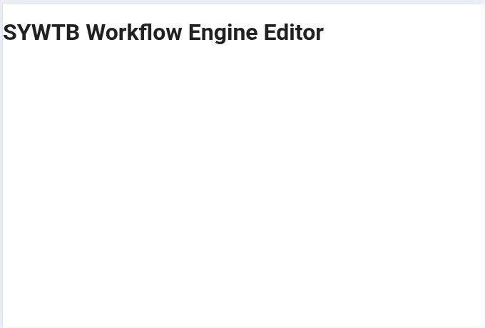
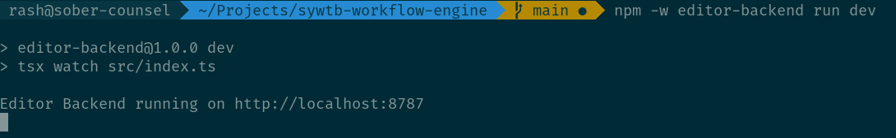
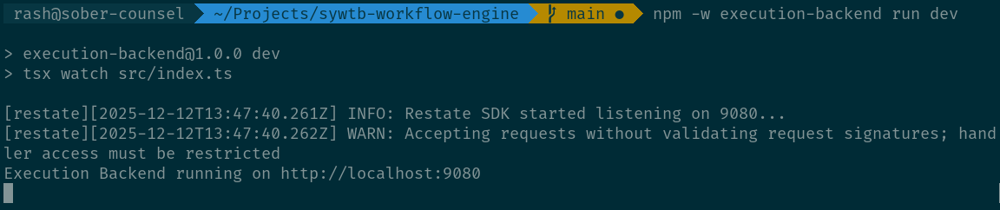
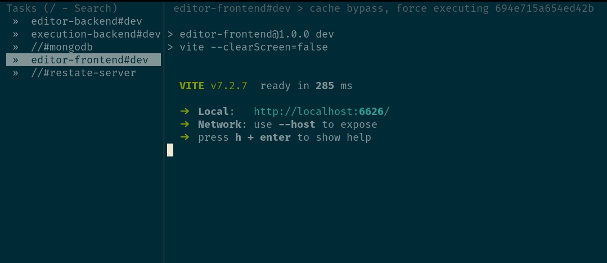

# Setup

Before we get to build the fun parts though, we need to do some setup work.
While writing the first chapter, I already [initialized a git repo, a package.json file and have added vitepress to render the docs](https://github.com/rashfael/sywtb-workflow-engine/commit/60cd30905dfbe15f7f925ab8118a44efe24ae2ad).

## Folder Structure

For the whole project I'll be going with a monorepo using npm workspaces, so let's take care of the rough folder structure now.

### `/docs`

Contains the vitepress documentation site, you're reading it right now!

### `/editor-frontend`

The sole frontend right now, but there might be more in the future, so I'm going to be a bit more specific with the name.

### `/editor-backend`

The backend for the editor. Only provides APIs for the editor frontend and writes config to be exectured by the execution backend.

### `/execution-backend`

Actually runs the workflows defined in the editor. Uses restate as a durable execution engine.

### `/runtime`

We need to share the sandbox host and guests between frontend and the backends. It's also a pretty important part of the system, so it deserves its own folder.

### `/common`

Shared code that is used everywhere.

### `/definitions`

Definitions for just node types. This is static right now, but can be linked dynamically to specific workflows later.

### `/types`

Shared TypeScript types for all parts of the system.

### `/tools`

Tools for managing the platform, like managing users, killing stuck workflows, doing migrations, etc.

## Dev Tools

Next up, we need to set up some important configs for development like a linter, autoformatting and more.

### Typescript

Especially while prototyping I'm not a fan of TS strict mode, so I'm configuring TS to infer types whenever possible and not be too strict about anything. We can always tighten this up later.

### Linting and Formatting

I'm going to use eslint with stylistic as formatter with autofixing enabled and will disable prettier entirely (for anyone having it installed in their editor).

For a more detailed reasoning, Anthony Fu has a great post about [Why Not Prettier](https://antfu.me/posts/why-not-prettier).

I'm of course going to use my own [eslint-plugin-vue-pug](https://github.com/rashfael/eslint-plugin-vue-pug).

TODO : stylelint

[Here's what we got so far](https://github.com/rashfael/sywtb-workflow-engine/commit/74e9c849d3cb058fa52cf7024f6e3fdb4e87fcd9)


### Task Runner

I'll try out nx for running interdependent tasks across the monorepo. I've never used it before, so let's see how it compares to turbo.

::: info A Word on Containerization
With nodejs/npm I don't see much value in containerizing the individual services for development. Running in production, sure, but for prod the usage pattern is completely different (no hot reloading, file watching, installing new packages on the fly, etc).
:::

## Skeleton

Now that the generic tooling is set up, I'm installing the core dependencies and making sure they all work.

### Editor Frontend

It's Vue time! I'm not going into details here, the respective Getting Started guides for Vue, Vite and Vue Router do a way better job if you're interested. Also I'm using my own component library, [buntpapier](https://v3.buntpapier.rash.codes/).

The goal is just to set up the frontend build chain, it's enough to show some simple page:



*[git commit](https://github.com/rashfael/sywtb-workflow-engine/commit/5f19b6b4858471d617583a7b64d638f68b0e013a)*

### Editor Backend

Not much to do here for now, just starting a nodejs server running hono with tsx and a test route.


*[git commit](https://github.com/rashfael/sywtb-workflow-engine/commit/0ef9fecf152d586d7d5c2e3530605ac4b0c628c3)*

### Execution Backend

The Execution Backend will provide restate services, so let's set up the restate sdk as a first step.


*[git commit](https://github.com/rashfael/sywtb-workflow-engine/commit/e9e721051531a5cd0ac866abb862f57fe9560264)*


### Running a db container

To get a reusable mongodb instance we configure a docker compose file and run `docker compose up mongodb` as a npm task.

### Restate Server

We also want a local restate server, so doing

```sh
npx @restatedev/restate-server --config-file restate.toml
```

as a npm task will do the job, together with tuning it a bit in a `restate.toml` file.

### Running everything as one command

I've set up nx to run all dev tasks with one command:

```sh
npm run dev
```

and properly configured dependencies between the tasks, so the mongodb container and the restate server start before the backends that depend on it (for values of "before", nx does not really provide wait times or health checks or anything).

HOWEVER, it seems like nx does not terminate the restate-server properly, so I'm going to fall back to turbo for task orchestration (which has other problems, but at least works).



*[git commit](https://github.com/rashfael/sywtb-workflow-engine/commit/cdb1c1a6a01d71b938e8fbba2e0e90ef0855bd20)*

`/runtime` will be a library used by both frontend and backends, so we don't have anything to do there right now.

::: warning A Word on Testing
I don't do TDD. Especially while prototyping and APIs are still in flow. I am adding a bunch of tests once I iterated enough on the design to to the mayor thing tests are for: preventing regressions and monitoring the whole system.
:::
