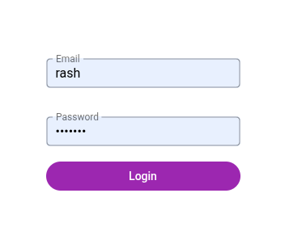
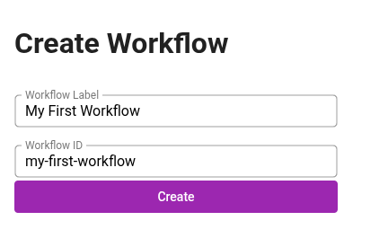
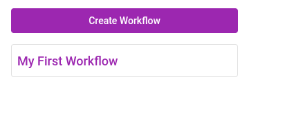

# Setup 2: Applicatic Boileroo

Tragically, we're not done with boring setup yet because we still need to build some dreadfully generic single page application features.

::: warning

I'll be doing quite a lot of corner-cutting here to get to the meat of the project asap, which I would not do on a production project.

:::

## Authentication

I want to do multiplayer in the future, and while we could skip authentication for a toy showcase, I need a user object, so I'll just throw in some extremely simple email+password auth which can be exchanged for a JWT. In a commercial application I would of course use a dedicated identity provider.

To store users, the editor backend also needs to connect to the database. I'm going to use the basic mongodb driver for this without an ORM and just add types for each collection in a `mongodb.ts` file.

To make things even simpler, users will just be created on login if they don't already exist. No email verification, no password reset. I might add signup moderation once I host this publicly.

I won't be going into depth here how exactly authentication works (token stored in localStorage, routes with a `requiresAuth` meta field, the usual), here is the code:

*[git commit](https://github.com/rashfael/sywtb-workflow-engine/commit/e28a0a85fa1a45a9ed5acd2de6ceb4572ec98395)*

## State Management

I'll also drop in a simple store factory for the frontend I'm going to use later, based on Vue's `reactive`. I'm not going to go with Pinia here, because we won't need SSR or anything, which simplifies the store code a lot.

*[git commit](https://github.com/rashfael/sywtb-workflow-engine/commit/164d9011342cb5b92aa42895ed793ea3abac7e7e)*

## Workflow Creation and Navigation

Lastly, users need a way to create and select workflows. I will scope every workflow to a single user for now. In a commercial application, I'd add namespaces / organizations from the start.

Workflows get a human readable label and a unique machine id each. I am not too concerned about namespacing right now, so all workflows of every user will share a global namespace. No `test` workflow for you, Franklin, another user already created that one!

*[git commit](https://github.com/rashfael/sywtb-workflow-engine/commit/f6690ff0468da00a4ab068906e2e28ba856d0567)*

Workflow metadata is stored in a mongodb collection, while the actual definitions will be stored in object storage, which is where the fun finally begins.

On to the next chapter!

