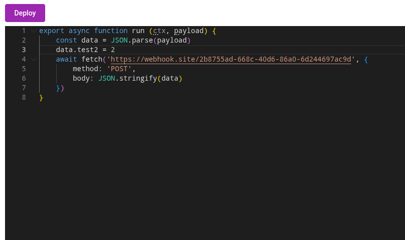

# Playing With Sandboxes

Now that users can configure workflows by editing code we need to execute that user-generated code somehow.
Just running it via `eval()` in our nodejs process is of course a horrible idea, opening us up to all kinds of security vulnerabilities.
What we want is a **sandbox** where we can safely execute code without it being able to access any of the host's resources.

::: info Note
I'll be using the **host** / **guest** terminology here to refer to the outside / inside of the sandbox.
:::

## Choosing a Sandboxing Technology

Sandboxing code is usually pretty specific to the host environment. Node.js for example offers the [node:vm](https://nodejs.org/api/vm.html) module, which exposes an API to create new v8 context. The documentation itself however says `The node:vm module is not a security mechanism. Do not use it to run untrusted code.`. v8 also has another, better, sandboxing mechanism, [Isolate](https://v8docs.nodesource.com/node-0.8/d5/dda/classv8_1_1_isolate.html), which is a C++ API. That would have been a valid choice 5+ years ago (and is what cloudflare workers use under the hood).

We have a way better option now though: **WASM**, or **WebAssembly**.
Wasm itself is just an instruction format (just like assembly, hence the name) for a virtual machine. One big benefit Wasm has over other host+guest-specific solution is that there a bunch of different runtimes that can run wasm, including browsers, which allows us to do local previews.
A ton of programming languages can also either compile to Wasm or can otherwise be embedded into a Wasm guest. For our workflow engine, this means we could allow users to allow writing workflow config in python or something else with little additional effort.

::: tip History Tidbit
The idea of a intermediate format to run code in a virtual machine is not new. Java does this with their JVM bytecode and C# has the CLR (Common Language Runtime), which is why the JVM and .NET support different languages like Kotlin or F#.
:::

While there are ways to compile JavaScript into static WASM, especially since garbage collection is now a feature in most WASM runtimes, they usually come with a couple of drawbacks and support only a subset of JS. We want to support arbitrary JS any user might write though. So what we'll be doing is embedding a **whole** js engine into the guest. I'm not going to do that myself though since a lot of clever people at the bytecodealliance already put in the work and created [jco](https://github.com/bytecodealliance/jco) and [componentize-js](https://github.com/bytecodealliance/componentize-js), which uses a modified version of Mozilla's SpiderMonkey JS engine called StarlingMonkey. There are also other embeddable js engines like [quickjs](https://bellard.org/quickjs/), but those need a bit more work to integrate.

## Guest API

Before we get into the weeds of running guest code, we need to decide on the API that the guest code will be using to do its thing. For now, we just need two things:

- Input: How does the guest receive data from the outside?
- Output: How does the guest call things like outside APIs to deliver results?

### Input

For input, I'll go with a pretty simple public API right now that will roughly look like this:

```
https://api.sywtb-workflow-engine.rash.codes/workflows/my-workflow-id/execute?entry-point=some-entry-point
```

which you can POST a json payload to.

::: warning A Word On Security
I'm not too concerned with security at this point, checking an API key will be good enough. I might add request signing and obfuscated urls later.
:::

The guest side will be equally simple and looks like this:

```ts
export async function run (ctx, payload) {
	if (ctx.entryPoint === 'some-entry-point') {
		…
	}
}
```

### Output

We could do a functional approach and have the guest code return something, but I'll go with a much more flexible approach and just allow the guest to call async host apis. As a bonus, we can use this host api later to implement our no-code functionality. For starters I will allow the builtin `fetch` api to make outgoing http requests but I might want to restrict that later.

```ts
export async function run (ctx, payload) {
	…
	await fetch('https://some-external-api.com/endpoint', {
		body: payload
	})
	…
}
```

## WebAssembly Component Model

The core WebAssembly APIs are extremely low level and not something you'd want to work with directly. Thankfully, there is a standard that builds on top of those low level APIs and makes working with WebAssembly a lot easier: the [WebAssembly Component Model](https://component-model.bytecodealliance.org/introduction.html).

The people over at the bytecodealliance wrote a good explainer on [why the component model is needed](https://component-model.bytecodealliance.org/design/why-component-model.html), which I recommend you read before continuing here.

To use WebAssembly components we need to define an interface for our guest module in the [WebAssembly Interface Types](https://component-model.bytecodealliance.org/design/wit.html) language:


```wit
package sywtb_workflow_engine:runtime@0.1.0;

world runtime-guest {
	record ctx {
		entry-point: string
	}
	export run: func(ctx: ctx, payload: string);
}
```

::: warning Skipping Steps
In this first version I'm keeping things simple and ignore things like different host api versions.
Later I might either do a lower level api in wit or do dynamic wit generation and parsing.

Another big issue I'm ignoring for now is async guest functions. WASI p3 will support async functions natively, but until then we'll need to do good ol' rpc correlation ids to make async calls work (in a later chapter).
:::

Putting both the wit and guest code together through `compontentize` gives us a component. There are WebAssembly that can run components natively, like [wasmtime](https://wasmtime.dev/), but browsers and node.js can only run core wasm modules. To generate core modules and glue code to run our component we need to use `jco/transpile`, which for our example would give us a couple of files, most importantly `workflow.js` containing the js glue code and `workflow.core.wasm` containing the js engine and the guest code. The component also contains some additional core modules (core2 to core4 in this case) that are way smaller and *probably* do some ABI stuff, memory management and so on (what they do exactly isn't well documented and after a while I stopped digging). `jco/transpile` also generates typescript type definitions.

```ts
const { component } = await componentize(workflowSource, {
	witPath: path.join(import.meta.dirname, './runtime.wit')
})


const { files } = await jco.transpile(component, {
	name: 'workflow',
	instantiation: 'async'
})
```

::: tip Tip
Both WebAssembly components and core modules have a file ending of `.wasm`, if we were to store them both. They do differ in their [binary headers](https://github.com/WebAssembly/component-model/blob/main/design/mvp/Binary.md) though.
:::

Since `componentize` + `transpile` is pretty expensive I'll be doing those steps when the workflow is getting deployed and not on every execution. From experience I know that the js glue code and all core modules except the first one are the same for every workflow which means I can compile those once statically and only load the actual guest wasm module dynamically on execution. For users to trigger a deployment I'll add a simple "Deploy" button alongside the code editor:



When the user clicks that button, the current code gets compiled and transpiled and the resulting `workflow.core.wasm` gets saved to some storage (for now just the local filesystem, later something like s3). The other core modules and js glue code are saved statically to the editor backend.

Execution itself is pretty straightforward. Because I chose the `async` instantiation mode when transpiling, I can provide core modules dynamically to the `instantiate` function that `jco` generated:

```ts
async function getCoreModule (modulePath: string) {
	if (modulePath === 'workflow.core.wasm') return await WebAssembly.compile(core) // the core module saved to storage when the workflow was deployed
	// else return statically built core modules
}

const instance = await instantiate(
	getCoreModule,
	new WASIShim().getImportObject()
)

// run is the function the guest exported and that we defined in wit
return await instance.run({ entryPoint: '' }, JSON.stringify(payload))
```

Just for testing I'm going to expose workflow execution in the editor backend on `/execute/:workflowId`.
With this endpoint in place we got ourselves user-editable guest code that safely* runs on a server!

::: warning Skipping Steps
To do proper sandboxing we will need to disable the WASI shims that jco adds by default, which provide things like stdio, http, clock and random apis to the guest. Those APIs are way too broad (especially http) and we want to restrict what the guest can do more tightly. I'll cover that in a later chapter.
:::

Have a look at the [full code for wasm compilation and execution here](https://github.com/rashfael/sywtb-workflow-engine/commit/c2c37fe29cbf73549975ac714aec5194b2f53624).

In the next section I'll replace the temporary execution endpoint with a proper execution backend powered by restate.
