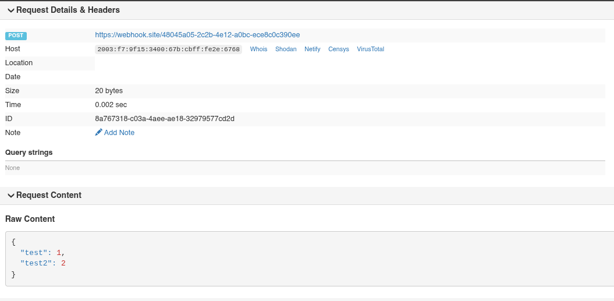

That's it for the first chapter!

Let's revisit the goals for the first iteration:

1. Build the collaborative editor


Check!

2. Build the workflow execution backend:

Running:

```sh
curl http://localhost:8888/my-first-workflow/execute -H 'content-type: application/json' -d '{"test": 1}'
```

calls an external webhook:



Check!

I collected a couple of todos that have nothing to do with building a workflow engine itself, here are a couple of commits that improve UX and fix bugs:

- [fine-grained jwt for workflow api and loro api](https://github.com/rashfael/sywtb-workflow-engine/commit/ca5d1d25a3b2d863ab7926f64c18676e6b5e68f2)
- [handling expired tokens in the UI](https://github.com/rashfael/sywtb-workflow-engine/commit/5d31f008be015ccdd8eae7a6353686f63f8cc8b8)

One big code blob is of course extremely boring, so in the next chapter I will show you how to design and build a low-code graph editor based on the tech I built so far.
